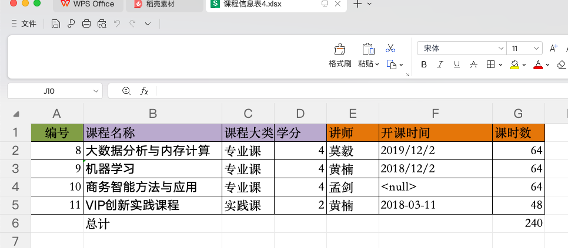
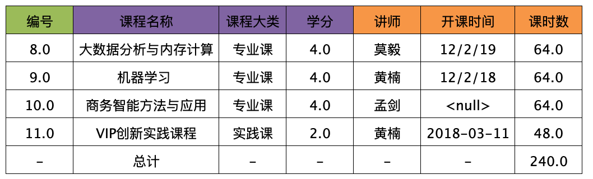

# excel_to_image 项目
本项目主要是利用 apache 的 poi + ai 的能力将 excel 文件转换为图片，支持多页添加表头生成 PNG 图片

`欢迎共同交流，如果有用的话，欢迎 fork ，star 该项目`

当前目前仅实现了基础的 excel 单页 sheet 转换为图片的能力，对于复杂列和行的处理，暂未实现。

## 实现效果如下:

原始的 excel 文件如下:



使用代码生成的图片效果如下:



使用方法:

1. 引入依赖:

2. 由于目前并没有将其发布到仓库中，使用前需要将 docs/lib 中的 `excel_to_image-0.0.1.jar` 添加到项目中,

2. 使用方法:

```java
@Slf4j
public class Main {
    public static void main(String[] args) throws IOException {
        // excel 文件路径
        String excelPath = "/Users/zj/Desktop/test_excel/课程信息表4.xlsx";
        BufferedInputStream excelInputStream = FileUtil.getInputStream(excelPath);
        Map<String, BufferedImage> imageMap = ExcelDrawUtil.excelToPngWithColor(excelInputStream, FileTypeEnum.XLSX);
        imageMap.forEach((imageName, image) -> {
            System.out.println("imageName: " + imageName);
            System.out.println("image: " + image);
            try {
                // 保存图片
                ImageIO.write(image, "png", new File("/Users/zj/Desktop/test_excel/image/" + imageName));
            } catch (IOException e) {
                throw new RuntimeException(e);
            }
        });
    }
}

```
# 其他问题:

1. 该工具主要是针对 excel 的数据进行网格图片格式的转化，对于大体的数据合并结构保留，但是不会保留 excel 的表格线条，纯闭合的线条，比如存在部分没有连接的线条，该工具生成的图片会连接相关的线条。
2. excel 数据如果超过 100 条，会进行分页生成。对于分页生成的数据，如果需要指定分页的大小，请参考 `com.zj.excel.to.image.dto.ExcelDrawImageRequest` 的 `defaultRowLength` 属性来进行配置。
3. 本工具支持基于 ai 提取 excel 的表头，在多行数据中，可基于 ai 提取的表头，为多页的表数据进行表头的生成。

如果有任何使用的问题欢迎留言和交流

微信号: zbusTop
